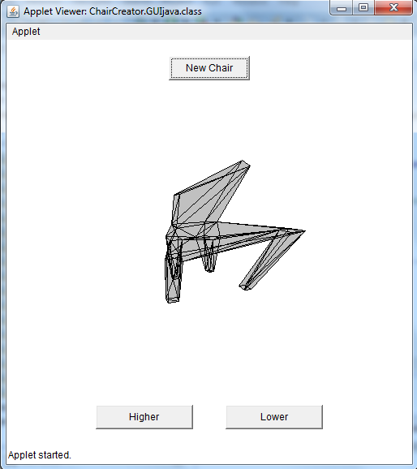
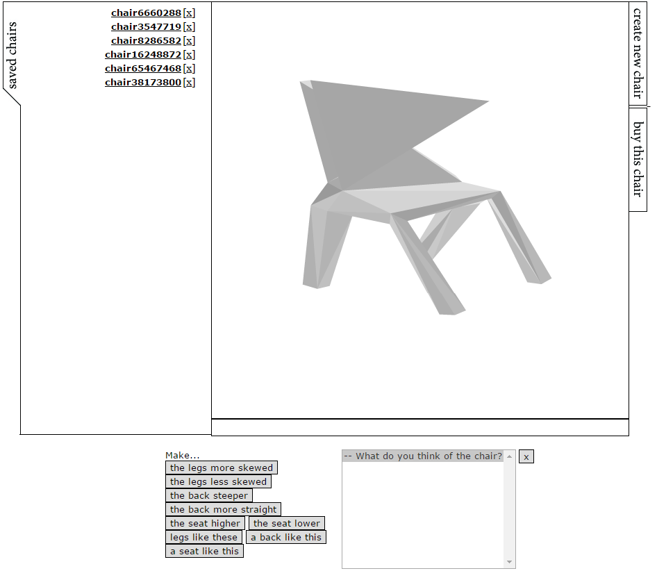

## Random Project

### Generating Random Chairs

We started this project with a question: 

> What is the essence of an object? 

By breaking down the essence of an object, you create boundaries, or rules that can be used in an algorithm that generates objects. This idea is tested on a chair. We defined a chair by pointing out ten points and their relations witheach other. Two points for the back, four for the seat and another four for the legs. Connect the dots and you will reveal a chair. 

The first part of this project consists of an algoritmh that attempts to build a chair in a pre-defined area from ten (randomly placed) points. The algorithm consists out of a couple of boundaries in which the points should fall. For instance, the algorithm contains a rule that a seat must be able to be formed out of four points such that the seat is reasonable straight. Another example is that all the leg points have to lie within a height distance.

### Customized chairs for 3D Printing

The rules described above are parameterized. For instance, the maximum distance in height between two legs is at most _d_. Such parameters can be used a indications for preferences that users may hold over objects. Thus, it is interesting to consider whether it, in theory, would be possible to define someone's preferences using these parameters.

The second part of this project consists of a website in which the user is able to generate chairs, and then reveal their preferences over this chairs. For instance, the user may think the chair is too high, or the legs are too small. By taking this input into account, new chairs a being generated.

In the final step, we translate these chairs into [STL format](https://www.wikiwand.com/en/STL_(file_format)), which means that they can be printed by a 3D printer.
